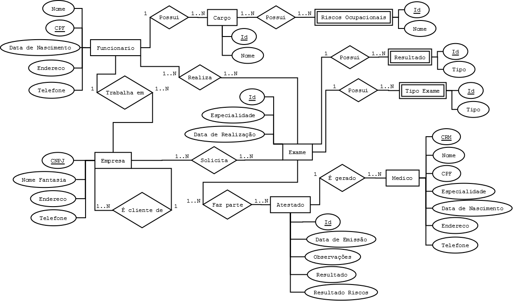

# Conceitos Básicos (Bancos de dados)

- Um banco de dados é simplesmente uma coleção/software que tem como principal função armazenar dados.
- Bancos de dados podem ser persistentes (PostgreSQL, SQLite...) ou não persistentes (Redis).
- Bancos de dados são gerenciados por um **SGBD/DBMS** (Sistema de Gerenciamento de Banco de Dados ou Database Management System).
- São exemplos de **SGBD/DBMS** o próprio PostgreSQL; quando me refiro ao PostgreSQL, refiro-me ao serviço que roda em segundo plano e gerencia os bancos de dados PostgreSQL.

## Tipos de bancos de dados

- **Bancos de dados relacionais:** São bancos de dados estruturados em tabelas/relações. Seguem princípios matemáticos da teoria de conjuntos.
- **Bancos de dados orientados a objetos:** As informações em um banco de dados são representadas na forma de objetos, como na programação orientada a objetos. São exemplos de BDOO (bancos de dados orientados a objetos): db4o.
  - Esses bancos não possuem uma alta aceitação no mercado devido à sua falta de padronização de DSLs (Domain-Specific Languages).
  - Havia problemas de otimização em comparação à maturidade dos bancos de dados relacionais (BDR).
  - Frameworks/Bibliotecas como Hibernate e ORMs solucionaram o problema de ter que escrever consultas diretamente em SQL.

- **Bancos de dados distribuídos:** São bancos de dados que suportam a fragmentação em diferentes processos que podem rodar em diferentes máquinas, facilitando a escalabilidade do sistema. Bancos de dados que suportam clusters são exemplos de bancos de dados distribuídos.
- **Bancos de dados não relacionais ou NoSQL:** São bancos de dados que permitem uma liberdade maior na estrutura em que os dados são armazenados e manipulados.
  - Diferente dos bancos de dados relacionais, onde você deve definir um schema/estrutura antes de poder inserir alguma informação, nos bancos de dados não relacionais isso não é necessário.
  - Bancos de dados não relacionais suportam valores compostos. Ou seja, é possível armazenar objetos em um único campo. Nos bancos de dados relacionais, seria necessário utilizar mais de um campo ou JOINs entre diferentes tabelas.

- **Bancos de dados multimodelos:** São sistemas de banco de dados que suportam o gerenciamento de mais de um tipo de banco de dados com diferentes estruturas. Por exemplo: Oracle Database, Azure Cosmos DB, Redis Enterprise e Google Cloud Spanner.
- **Bancos de dados de documentos/JSON:** São bancos de dados que suportam o armazenamento de valores no formato JSON (JavaScript Object Notation). O MongoDB é um exemplo de banco de dados de documentos/JSON (embora armazene em um formato derivado, o BSON - Binary JSON).

## Modelo conceitual

O modelo conceitual é a etapa antecessora da implementação e estruturação direta no SGBD escolhido (PostgreSQL, MySQL...). Ele consiste na estruturação abstrata das entidades e de como elas se relacionam no seu domínio de negócio (regras de negócio).

<p align="center">

</p>

## Índices

Índices são estruturas de dados que têm como função otimizar a busca por informações em um banco de dados. Eles funcionam como o índice de um livro, onde você tem uma lista de palavras-chave e a página onde elas estão localizadas. Em bancos de dados relacionais, por exemplo, são criados índices para constraints como UNIQUE e PRIMARY KEY. Internamente, é criada uma B-Tree para representar os índices de uma tabela. Ter muitos índices gera um custo, visível em situações de alta frequência de escrita na tabela, pois os índices precisam ser atualizados a cada operação. Por isso, é importante analisar quais índices são realmente necessários para o seu caso de uso. O ideal é criar índices apenas para as colunas mais utilizadas em consultas e que possuam uma alta cardinalidade (muitas informações distintas).

```sql
CREATE TABLE users (
  id SERIAL PRIMARY KEY,
  email VARCHAR(255) UNIQUE
);
```

- Nesta tabela `users`, foram criadas duas estruturas de índices: uma para a PRIMARY KEY e outra para a UNIQUE. O índice da PRIMARY KEY é utilizado para garantir a unicidade e a integridade dos dados, enquanto o índice da UNIQUE garante que não haja duplicatas no campo email. Ou seja, a cada inserção, o índice da PRIMARY KEY será acessado para verificar se o ID já existe, e o da UNIQUE para verificar o email. Se a tabela tiver muitos registros, esses índices ajudarão a acelerar as consultas, mas também podem aumentar o tempo de escrita, pois precisam ser atualizados a cada inserção ou atualização.

## Índice clustered

De forma simplificada, bancos de dados alocam memória para uma página de 8KB na memória RAM, e cada página tem um ponteiro para a próxima, formando uma lista encadeada. O início dessa página é o header, onde são armazenadas as informações daquela página, além de slots e o offset para a próxima posição livre.

```c
#include <stdint.h>
#include <stdio.h>
#include <string.h>

typedef struct page_header {
  uint32_t page_id;
  uint32_t next_page;
  uint16_t slot_count;
  uint16_t free_space_offset;
} t_page_header;

typedef struct user_row {
  int id;
  int type;
} t_user_row;

#define PAGE_SIZE 8192

int main() {
  uint8_t page_buffer[PAGE_SIZE];
  memset(page_buffer, 0, PAGE_SIZE);

  t_page_header *header = (t_page_header *)page_buffer;

  header->page_id = 300;
  header->slot_count = 15;
  header->free_space_offset = sizeof(t_page_header);

  printf("Next space offset: %d\n", header->free_space_offset);

  t_user_row row = {1, 2};

  memcpy(page_buffer + header->free_space_offset, &row, sizeof(t_user_row));

  for (int i = 0; i < 64; i++) {
    printf("%02X ", page_buffer[i]);
    if ((i + 1) % 16 == 0)
      printf("\n");
  }

  return 0;
}
```

O problema de índices comuns é que, às vezes, um registro pode ser armazenado entre duas páginas, o que exige o acesso a mais de uma página para a leitura, tornando o processo custoso. O índice clustered é uma estrutura que organiza os registros de uma tabela de acordo com a ordem dos valores de uma coluna específica, chamada de chave clustered. Isso significa que os registros são armazenados fisicamente na ordem da chave clustered, o que melhora a performance das consultas que utilizam essa chave. No entanto, isso também pode aumentar o tempo de escrita, pois os registros podem precisar ser reorganizados fisicamente na tabela a cada inserção ou atualização. É mantida uma estrutura separada no banco (uma B-Tree), onde são armazenados o valor da chave clustered e um ponteiro para a página correspondente. Assim, quando uma consulta utiliza a chave clustered, o banco acessa diretamente a página necessária. É fundamental analisar quais colunas são mais utilizadas em consultas e possuem alta cardinalidade para escolher a chave clustered adequada.
